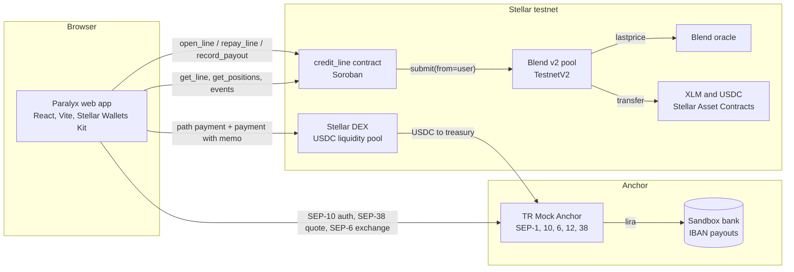
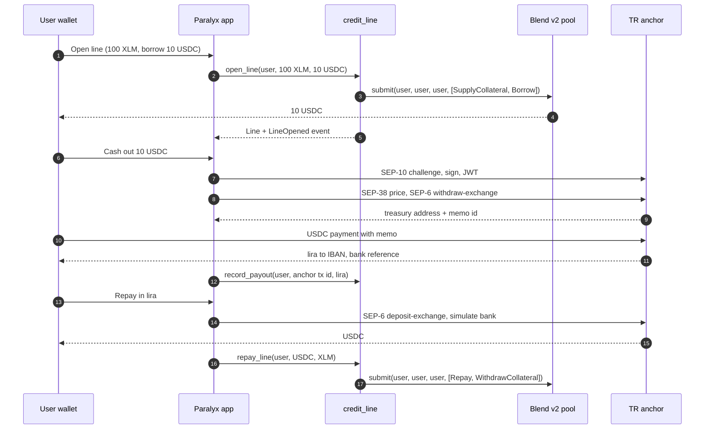

# Paralyx

**Turkish lira liquidity without selling your XLM.** Post XLM as collateral to a Blend v2 pool, borrow USDC, cash the USDC out as lira to a bank account through a SEP-6 anchor, and repay in lira. Everything runs on Stellar testnet.

Live app: https://paralyx.vercel.app · Contract: [`CDZ22YMZ…L5Z4B`](https://stellar.expert/explorer/testnet/contract/CDZ22YMZKGQZVHJKRJITRZREFKCTCURUKRC63G7ABIPO6SBHXTXL5Z4B) · Track: Rise In x Stellar Pro Hackathon, Scale track, Istanbul, 19 to 20 September 2026

> Testnet only. No real money moves. The anchor's bank leg is a sandbox; the Stellar leg, the Blend positions and the USDC are real testnet assets.

## Özet (TR)

Paralyx, kripto varlığını satmak istemeyen ama liraya ihtiyacı olan kullanıcı için teminatlı likidite hattı. XLM teminat konur, Blend v2 havuzundan USDC borç alınır, USDC hackathon'un TR anchor'ı üzerinden lira olarak IBAN'a ödenir. Geri ödeme yine lirayla yapılır: anchor'a lira yatırılır, gelen USDC borcu kapatır, teminat serbest kalır. Paralyx hiçbir noktada fon tutmaz; kredi karşı tarafı Blend havuzu, lira bacağı anchor'dır.

## Why

Turkey is among the world's largest crypto markets and households already dollarize against inflation. Holders who need lira today have one option: sell. Paralyx gives them the second option every mature market has, borrowing against the asset. The user keeps XLM exposure, gets lira in minutes, and closes the position later by depositing lira.

- **Users:** crypto holders in Türkiye who need short term lira liquidity, small businesses that hold stablecoins but pay suppliers in lira.
- **Value:** one screen, three actions. Open a line, cash out lira, repay in lira. No exchange account, no manual bridging, no selling.
- **Why Stellar:** Blend already runs the credit engine, anchors already speak SEP-6 for the fiat leg, fees are negligible, and the whole loop settles in seconds.

## How it works

1. Connect a wallet (Stellar Wallets Kit). On testnet the app funds it through friendbot and adds the two USDC trustlines.
2. Open a line. One Soroban transaction: the Paralyx contract submits `SupplyCollateral` and `Borrow` to the Blend v2 pool on the user's behalf. USDC lands in the wallet.
3. Cash out. The app authenticates with the anchor (SEP-10), takes a lira quote (SEP-38), opens a withdrawal (SEP-6 `withdraw-exchange`) and pays the anchor treasury with the memo it returned. The anchor pays lira to the IBAN and reports a bank reference. The app records the payout on the contract.
4. Repay. The app opens a SEP-6 `deposit-exchange`, the user sends lira to the anchor's IBAN (the sandbox simulates the bank), USDC arrives, and one transaction repays the Blend debt and withdraws collateral.

## Architecture





## What is integrated and why it is load-bearing

| Piece | Role | Without it |
|---|---|---|
| **Blend v2** lending pool (`TestnetV2`) | Credit engine: collateral factors, interest, liquidations, oracle | No credit. Paralyx never reimplements lending math |
| **TR Mock Anchor** (SEP-1, SEP-10, SEP-6, SEP-12, SEP-38) | Fiat rail in both directions, lira in and lira out | No lira. The product is a Blend front end |
| **Stellar Wallets Kit** | Wallet connection and signing for Freighter, xBull, Lobstr, Albedo and others | Manual wallet plumbing |
| **Stellar DEX liquidity pool** | Converts between the two testnet USDC issuers (see below) | Anchor USDC and Blend USDC cannot meet on testnet |
| **Reflector** (through the anchor's SEP-38 rate) | USD/TRY mid rate for quotes and the lira limit | Static rate |

## Deployed artifacts (Stellar testnet)

| Item | Value |
|---|---|
| `credit_line` contract | `CDZ22YMZKGQZVHJKRJITRZREFKCTCURUKRC63G7ABIPO6SBHXTXL5Z4B` |
| Wasm hash | `372416665b3b71cb8282c791c3ab1b021e78ccd7702f8e6eb8f8eb175b8666de` |
| Deploy transaction | [`fdb56b80…6fc59`](https://stellar.expert/explorer/testnet/tx/fdb56b80d93f3dd63e2dcaad9fab871ce35ad6a248618d6bd10c08326466fc59) |
| Contract admin | `GDOZ44UXCLBBUTRQFOI6G5HQ5MGHG2LLEXALFKP4MTQBWEFHKPHDV52F` |
| Blend v2 pool (TestnetV2) | `CCEBVDYM32YNYCVNRXQKDFFPISJJCV557CDZEIRBEE4NCV4KHPQ44HGF` |
| Blend oracle | `CAZOKR2Y5E2OSWSIBRVZMJ47RUTQPIGVWSAQ2UISGAVC46XKPGDG5PKI` |
| XLM Stellar Asset Contract | `CDLZFC3SYJYDZT7K67VZ75HPJVIEUVNIXF47ZG2FB2RMQQVU2HHGCYSC` |
| Blend USDC (debt asset) | `CAQCFVLOBK5GIULPNZRGATJJMIZL5BSP7X5YJVMGCPTUEPFM4AVSRCJU`, issuer `GATALTGTWIOT6BUDBCZM3Q4OQ4BO2COLOAZ7IYSKPLC2PMSOPPGF5V56` |
| Anchor USDC (Circle testnet) | `CBIELTK6YBZJU5UP2WWQEUCYKLPU6AUNZ2BQ4WWFEIE3USCIHMXQDAMA`, issuer `GBBD47IF6LWK7P7MDEVSCWR7DPUWV3NY3DTQEVFL4NAT4AQH3ZLLFLA5` |
| USDC liquidity pool (both issuers) | `23283282cba3c5363761ac9a7ce1ca027f6205f07107c730a76cfc021b9439e9` |
| Anchor | `tr-mock-anchor.fly.dev`, treasury `GCLCZEQZ2THTEDAOFI66LACNPLY4OBKN7VKLEZFMBIHYKYQOW2W7T3Z6` |
| Paralyx market maker | `GBMT43HXUDOSTBA4ALPIFJWRI72PH5YICAQIDOEJ23YEWUZ7TW2F6T7Q` |

Proof transactions from the build session: a full lira cash-out of 2 USDC that the anchor settled as 97.08 TRY with bank reference `FAST-NUG8V4XHN6` ([`d58c43f8…dfe4c`](https://stellar.expert/explorer/testnet/tx/d58c43f8cf23b9ffc350b9e04f1de3ec5cf7e5534e2bfebf5fe9ab06761dfe4c)), and the market maker's own line on Blend through the contract (8,000 XLM collateral, 2,000 USDC borrowed). Every `open_line`, `repay_line` and `record_payout` call emits an event; the [stats page](https://paralyx.vercel.app/stats) reads them straight from RPC.

## The contract

`contracts/credit_line` is a thin, auditable composition layer over Blend. It never holds tokens. All value moves between the user and the Blend pool; the contract records the line and emits events.

| Function | Auth | What it does |
|---|---|---|
| `__constructor(admin, pool, collateral_asset, debt_asset)` | deploy time | Stores config in instance storage. Runs once, so there is no reinitialization surface |
| `open_line(user, collateral_amount, borrow_amount)` | `user` | Builds `SupplyCollateral` and `Borrow` requests, calls `pool.submit(user, user, user, requests)`, creates or tops up the line, emits `LineOpened` |
| `repay_line(user, repay_amount, withdraw_collateral)` | `user` | `Repay` and `WithdrawCollateral` requests, updates the line, emits `LineRepaid`. Blend clamps over-repayment and over-withdrawal |
| `record_payout(user, anchor_tx_id, try_amount)` | `user` | Records a completed lira payout (amount in kuruş), emits `PayoutRecorded` |
| `get_line(user)`, `get_config()`, `get_line_count()` | none | Views |
| `positions(user)` | none | Passes through to `pool.get_positions` |
| `upgrade(new_wasm_hash)` | `admin` from storage | Upgrades the code |

Patterns worth pointing at:

- **Nested authorization.** The user signs once. `open_line` calls `user.require_auth()`, then Blend's `submit` calls `spender.require_auth()` and the token contracts require the same address again inside the sub-invocation tree. One signed authorization covers the whole tree, which is what makes a router contract possible on Soroban.
- **Storage.** Config and the line counter live in instance storage; each user's `Line` lives in persistent storage under `DataKey::Line(user)`. Every read and write extends the TTL (14 day threshold, 60 day extension), and every entrypoint bumps the instance TTL.
- **Events.** Typed `#[contractevent]` structs with the user as a topic, so wallets and the stats page can filter by address.
- **Validation.** Negative amounts panic with a typed error, empty request lists are rejected before any cross-contract call, and repay or payout on a missing line fails.

Tests (`cargo test`, 8 tests) run against a mock pool that records the forwarded requests and cover: request forwarding, auth requirement without mocked auths, rejection of empty and negative requests, aggregation on a second open, repay and withdraw forwarding, missing-line failures, payout recording and config storage.

## The testnet USDC seam

Blend's testnet pool lends its own test USDC (issuer `GATALT…`). The anchor pays and accepts Circle's testnet USDC (issuer `GBBD47…`). They are different assets on testnet and the same asset on mainnet. The app bridges the gap with the Stellar DEX: cash-out uses a strict-receive path payment (Blend USDC in, exactly the anchor amount of Circle USDC out) followed by the memo payment to the treasury, and repayment converts the other way before calling `repay_line`. During the build the shared liquidity pool between the two issuers was one-sided, so the Paralyx market maker rebalanced it to roughly 2,000 USDC per side at 1:1 ([`cc265840…547f0`](https://stellar.expert/explorer/testnet/tx/cc2658404c263f9fe3a2244e412579f1351b40d28ec6dfe310e12756e76547f0)). On mainnet this whole section disappears.

## The app

Five screens behind a sidebar, all reading from chain and from the anchor, nothing mocked:

- **Panel.** Available lira limit, collateral, debt, health factor, live lira and XLM charts, your activity.
- **Piyasa.** The Blend v2 TestnetV2 pool: total supplied and borrowed in USD, utilization, every reserve with price, supply and borrow APR from Blend's three slope rate model, collateral factors. Below it, Paralyx's own cumulative lira payouts and USDC borrowed, built from contract events.
- **Hareketler.** Protocol totals and the event feed, filterable to your address.
- **Hat aç.** Wallet setup (friendbot and trustlines on testnet) and the collateral plus borrow form.
- **Takas.** The exchange card: USDC to lira cashes out through the anchor, lira to USDC repays the line.

Charts use Reflector's mainnet FX oracle for USD/TRY (hourly points, as far back as the oracle keeps history) and Stellar DEX trade aggregations for XLM/USDC. Wallet connection is a custom modal over Stellar Wallets Kit.

## Repository

```
contracts/            Soroban workspace (credit_line)
web/                  React + Vite + Tailwind v4 app, Sora typeface, TR and EN
scripts/              Node helpers: anchor SEP flows, market seeding, cash-out and event checks
docs/                 Pitch outline and notes
```

### Build and test the contract

```bash
cd contracts
cargo test
stellar contract build
stellar contract optimize --wasm target/wasm32v1-none/release/credit_line.wasm
```

Deploy (constructor arguments after `--`):

```bash
stellar contract deploy \
  --wasm target/wasm32v1-none/release/credit_line.optimized.wasm \
  --source-account <deployer> --network testnet -- \
  --admin <G...> \
  --pool CCEBVDYM32YNYCVNRXQKDFFPISJJCV557CDZEIRBEE4NCV4KHPQ44HGF \
  --collateral_asset CDLZFC3SYJYDZT7K67VZ75HPJVIEUVNIXF47ZG2FB2RMQQVU2HHGCYSC \
  --debt_asset CAQCFVLOBK5GIULPNZRGATJJMIZL5BSP7X5YJVMGCPTUEPFM4AVSRCJU
```

Drive it from the CLI (the source account is the user; nested Blend and token auths are signed with it):

```bash
stellar tx new change-trust --source-account <user> --network testnet \
  --line USDC:GATALTGTWIOT6BUDBCZM3Q4OQ4BO2COLOAZ7IYSKPLC2PMSOPPGF5V56
stellar contract invoke --id CDZ22YMZKGQZVHJKRJITRZREFKCTCURUKRC63G7ABIPO6SBHXTXL5Z4B \
  --network testnet --source-account <user> -- \
  open_line --user <G...> --collateral_amount 1000000000 --borrow_amount 100000000
```

### Run the web app

```bash
cd web
npm install
npm run dev
```

Testnet configuration is in `web/src/config.ts`. The app needs a wallet supported by Stellar Wallets Kit set to testnet (Freighter is the easiest).

### Scripts

```bash
cd scripts && npm install
node anchor.mjs deposit <secret> 1000        # SEP-10, SEP-12, deposit-exchange, simulated bank, poll
node anchor.mjs withdraw <secret> 2          # withdraw-exchange instruction (treasury + memo)
node cashout-test.mjs <secret> 2             # full cash-out: convert, pay with memo, wait for the anchor
node rebalance-pool.mjs <secret> 1990        # swap Blend USDC into the shared pool
node events-test.mjs                         # decode contract events from RPC
```

## Stellar Skills used

- `skills/cross-chain/SKILL.md` and `skills/cross-chain/layerzero.md` from `stellar/stellar-dev-skill` for the roadmap facts on LayerZero, USDT0 and CCTP on Stellar.
- `skills/smart-contracts/security.md` from `stellar/stellar-dev-skill` as the review checklist for the contract (authorization on the address loaded from storage, no reinitialization path, TTL extension in hot paths, no arbitrary contract calls).
- `skills/dapp/SKILL.md` from `stellar/stellar-dev-skill` for the Stellar Wallets Kit v2 static API and the SDK v16+ ESM notes.
- `SKILL.md` from `yigitcangokmen/stellar-hackathon-turkiye` for the TR Mock Anchor endpoints, limits and asset identifiers.
- The anchor's own machine-readable guide at `tr-mock-anchor.fly.dev/llms.txt`.

## Design decisions and trade-offs

- **Compose on Blend instead of writing a pool.** The 2025 Paralyx prototype had its own lending pool. Rewriting it in a weekend would reproduce Blend with less safety. Composing gives real interest, liquidations and oracle handling for free and keeps the Paralyx contract small enough to read in five minutes.
- **User authorizes, contract routes.** Positions belong to the user on Blend, not to Paralyx. If Paralyx disappears, the user's Blend position and the Blend UI still work.
- **SEP-6 over SEP-24.** The hackathon anchor speaks SEP-6, and programmatic deposits let the app own the whole screen. The adapter is small, so a SEP-24 anchor is a swap, not a rewrite.
- **Strict-receive path payments.** The anchor needs an exact amount with a memo. Strict receive guarantees the exact Circle USDC amount regardless of testnet pricing quirks.
- **Everything readable without a wallet.** Views run as simulations against a read-only source account, so the stats page and the lira limit work before connecting.

## Technical challenges

- **Two USDCs.** Documented above; solved with the DEX and a rebalanced pool.
- **Anchor watcher only sees classic payments.** A Soroban token transfer from a contract does not show up as a Horizon payment, so the final leg to the treasury is a classic `payment` operation with the memo, sent by the user's own account.
- **Nested auth from a router.** Verified on testnet with the CLI before writing a single line of frontend, so the riskiest assumption was retired first.
- **SDK churn.** Soroban SDK 28 replaced `env.events().publish` with typed events and `update_current_contract_wasm` with `update_current_contract`; Wallets Kit v2 is fully static and moved to JSR. The code targets the current APIs.

## Regulatory posture

Paralyx is non-custodial software. It never holds user funds, never sets rates and is not the lender; the Blend pool is the counterparty. It never touches lira; a licensed anchor is the regulated party for KYC, AML and bank payouts. Product copy says "collateralized liquidity", not consumer credit. Before mainnet the plan includes a legal opinion on the CASP framework under Türkiye's 2024 crypto asset law and the consumer credit rules that apply to marketing.

## Roadmap after the hackathon

Toward an SCF Build award, Integration track, and InstAward:

1. **Licensed TRY anchor.** No production Turkish anchor exists yet; the SEP-6 adapter is written so the switch is a home domain change. Bridge and BlindPay are the fallback rails for USD and EUR.
2. **Mainnet.** Blend mainnet USDC pool, the same contract, one USDC. Audit of `credit_line` before real money.
3. **Idle collateral yield.** Route part of the collateral into a DeFindex vault so the line earns while it is open.
4. **Omnichain entry.** USDC from any EVM chain through Circle CCTP, and USDT through LayerZero's USDT0 on Stellar, so the lira line can be opened from assets that already live elsewhere.
5. **Private payouts.** Stellar Private Payments for salary style lira disbursements once it reaches mainnet.
6. **Health guardian.** Notifications and one-click top-up from lira when the health factor drops.

## Lineage and team

Paralyx started at a 2025 Stellar hackathon as a cross-chain LSD lending prototype ([paralyx-LSD/paralyx-protocol](https://github.com/paralyx-LSD/paralyx-protocol)). This repository is the 2026 rebuild around what the ecosystem now offers: Blend v2 for credit and anchors for lira.

Baturalp Güvenç (contracts, app, integrations) and Abdullah Valisoy (product and presentation).

## License

MIT
